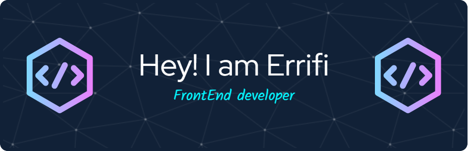

<!---

--->

<h1 align="center">Hi 👋, I'm Errifi</h1>
<h1 align="center" > A passionate FrontEnd Developer on a journey of continuous learning and growth. 🚀 </h1>

- 🌱 I’m currently learning **Next-JS**
- 💬 Ask me about anything. I will try to help you as much as I can.

<h3 align="left">Languages and Tools:</h3>
 

    
     
     
   
  
    
    
    

## 🌱 Learning and Growing

As a developer, I firmly believe in the importance of continuous learning. Currently, I'm immersing myself in Next.js to expand my toolkit and stay ahead of the curve. I enjoy exploring new technologies and frameworks, always seeking ways to enhance my skills and deliver top-notch solutions.

## 🚀 Projects and Contributions

Throughout my journey, I have had the privilege of working on various exciting projects, honing my skills and collaborating with talented individuals. You can explore my repositories to see some of the projects I've been involved in. I love creating user-friendly interfaces, optimizing performance, and writing clean, maintainable code.

<!---
## 📫 Let's Connect

I'm always eager to connect with fellow developers, exchange knowledge, and collaborate on interesting projects. Feel free to reach out to me via [email](mailto:errifi@example.com) or connect with me on [LinkedIn](https://www.linkedin.com/in/errifi). Let's code together and make a positive impact in the digital world!
--->

## ⚡ Fun Fact

Did you know that Next.js is not only a fantastic framework but also environmentally friendly? It's optimized for serverless and has built-in features that minimize energy consumption, making it a sustainable choice for the future of web development. Together, let's build a greener and more efficient web!

Thank you for visiting my GitHub profile! Feel free to explore my repositories, star your favorite projects, and join me on this exciting journey of frontend development. Let's create amazing experiences together! ✨

<!---
Abdessamadds/Abdessamadds is a ✨ special ✨ repository because its `README.md` (this file) appears on your GitHub profile.
You can click the Preview link to take a look at your changes.
--->
